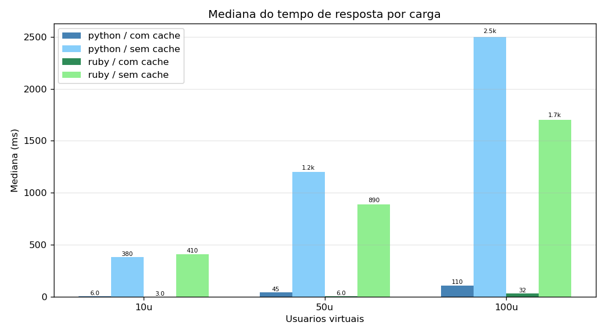
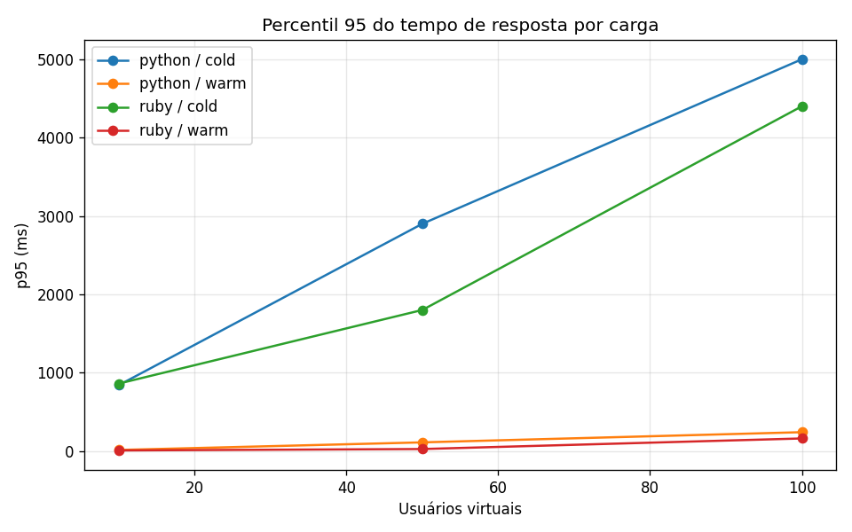
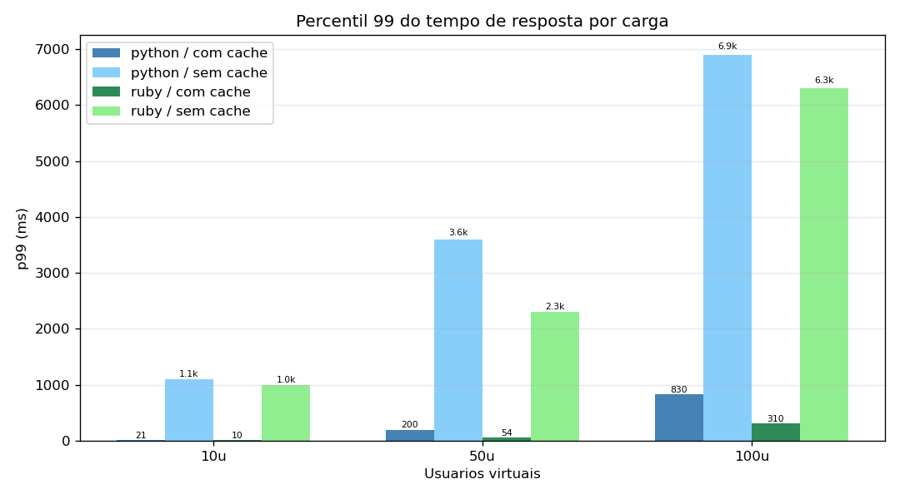
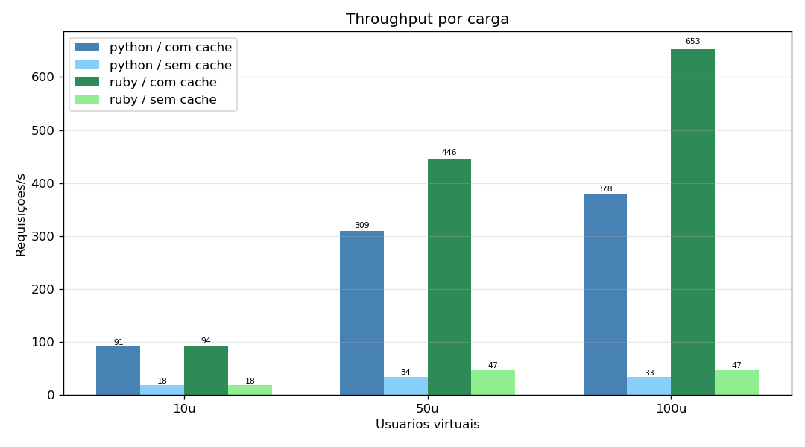
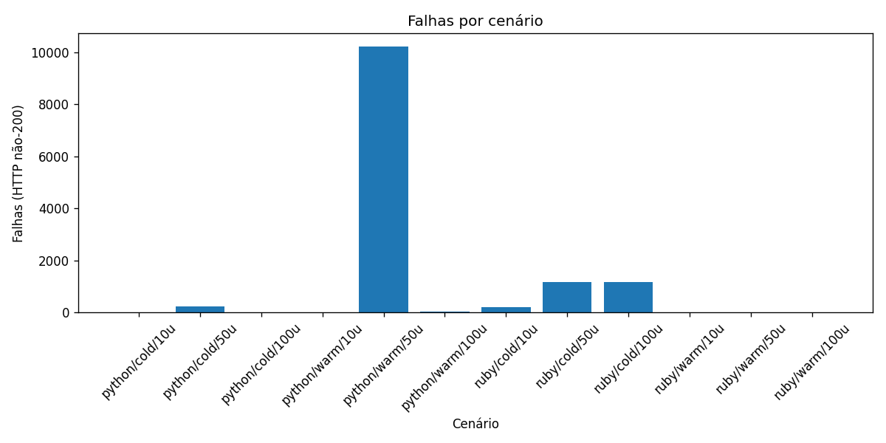
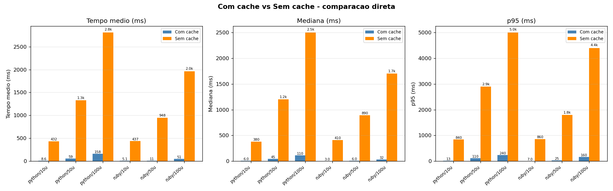
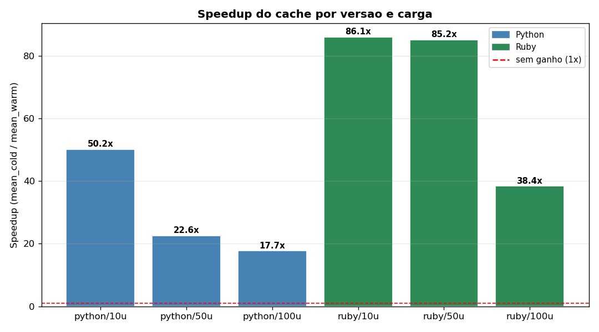
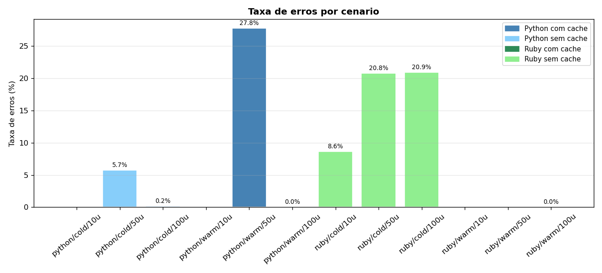
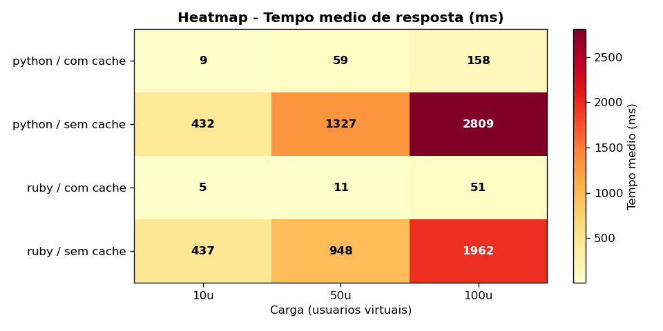

# Trabalho 4 - Testes de Desempenho com Link Extractor

## Grupo C

| Integrante | Matrícula |
|---|---:|
| Caio Barros | 2315082 |
| Leonardo de Saboia | 2310333 |
| Gustavo Sousa | 2315053 |
| Kaíke Petalas | 2310331 |
|

Este repositório contém a implementação do **Trabalho 4** da disciplina de Computação Distribuída, com testes de carga no serviço **Link Extractor** (versões Python e Ruby) usando **Locust** em ambiente Windows.

PDF original do enunciado: [`docs/Trabalho 4 – Realização de Testes de Desempenho com a Aplicação Link Extractor.pdf`](docs/Trabalho%204%20%E2%80%93%20Realiza%C3%A7%C3%A3o%20de%20Testes%20de%20Desempenho%20com%20a%20Aplica%C3%A7%C3%A3o%20Link%20Extractor.pdf)

## Objetivo do trabalho

Comparar desempenho e estabilidade entre as duas APIs do Link Extractor em cenários com e sem cache Redis, variando o nível de concorrência.

| Fator | Valores |
|---|---|
| Versão da API | Python / Ruby |
| Modo de cache | Com cache (`warm`) / Sem cache (`cold`) |
| Usuários virtuais | 10 / 50 / 100 |

Total: **12 cenários**.

## Métricas coletadas

Para cada cenário, o Locust gera:

- `*_stats.csv`: média, mediana, p95, p99, min, max, throughput e falhas
- `*_stats_history.csv`: série temporal por segundo
- `*_failures.csv` e `*_exceptions.csv`: detalhes de erros

Artefatos consolidados:

- Planilha final: `results/processed/consolidado.xlsx`
- Gráficos: `results/charts/*.png`

## Resumo numérico dos cenários

| Cenário | Média (ms) | Mediana (ms) | p95 (ms) | p99 (ms) | Throughput (req/s) | Falhas | Erro (%) |
|---|---:|---:|---:|---:|---:|---:|---:|
| `python_warm_10u_2m` | 8,61 | 6 | 13 | 21 | 91,03 | 0 | 0,00 |
| `python_warm_50u_2m` | 58,77 | 45 | 110 | 200 | 309,33 | 10216 | 27,77 |
| `python_warm_100u_2m` | 158,41 | 110 | 240 | 830 | 378,05 | 20 | 0,04 |
| `python_cold_10u_2m` | 432,03 | 380 | 840 | 1100 | 18,42 | 0 | 0,00 |
| `python_cold_50u_2m` | 1327,24 | 1200 | 2900 | 3600 | 34,40 | 234 | 5,73 |
| `python_cold_100u_2m` | 2808,86 | 2500 | 5000 | 6900 | 33,46 | 6 | 0,15 |
| `ruby_warm_10u_2m` | 5,08 | 3 | 7 | 10 | 93,59 | 0 | 0,00 |
| `ruby_warm_50u_2m` | 11,13 | 6 | 25 | 54 | 445,89 | 0 | 0,00 |
| `ruby_warm_100u_2m` | 51,05 | 32 | 160 | 310 | 653,24 | 4 | 0,01 |
| `ruby_cold_10u_2m` | 437,35 | 410 | 860 | 1000 | 18,42 | 189 | 8,63 |
| `ruby_cold_50u_2m` | 948,08 | 890 | 1800 | 2300 | 46,98 | 1157 | 20,75 |
| `ruby_cold_100u_2m` | 1961,86 | 1700 | 4400 | 6300 | 47,27 | 1175 | 20,92 |

## Gráficos e análise detalhada

### 4.1 Tempo médio de resposta por carga


Leitura detalhada:

- O cache reduz drasticamente a latência média: em `10u`, Python cai de `432,03 ms` (`cold`) para `8,61 ms` (`warm`), e Ruby de `437,35 ms` para `5,08 ms`.
- Sem cache, a latência cresce fortemente com carga: Python chega a `2808,86 ms` em `100u`, Ruby a `1961,86 ms`.
- Com cache, Ruby mantém vantagem clara em todas as cargas (`5,08` -> `11,13` -> `51,05 ms`) e escala melhor que Python (`8,61` -> `58,77` -> `158,41 ms`).

### 4.2 Mediana (p50) por carga



Leitura detalhada:

- A mediana confirma experiência típica muito rápida com cache: até `6 ms` em Ruby (`10u` e `50u`) e `45 ms` em Python com `50u`.
- Em `cold`, o usuário típico já sofre degradação acentuada: `1200 ms` (Python `50u`) e `1700 ms` (Ruby `100u`).
- A diferença média x mediana fica mais evidente em cenários com erro/outliers (ex.: Python `warm 50u`), sugerindo distribuição mais assimétrica.

### 4.3 Percentil 95 (p95) por carga



Leitura detalhada:

- Em `warm`, p95 permanece baixo: Ruby vai de `7 ms` (`10u`) a `160 ms` (`100u`); Python de `13 ms` a `240 ms`.
- Em `cold`, p95 sobe para faixas de segundos: Python atinge `5000 ms` em `100u`; Ruby chega a `4400 ms`.
- O p95 mostra que o gargalo sem cache não afeta só casos extremos, mas também parte relevante dos usuários.

### 4.4 Percentil 99 (p99) por carga



Leitura detalhada:

- Cauda extrema em `cold`: `6900 ms` (Python `100u`) e `6300 ms` (Ruby `100u`), com impacto direto nos piores 1% de requisições.
- Em `warm`, a cauda reduz de forma significativa: Ruby `100u` fica em `310 ms`; Python `100u` em `830 ms`.
- A distância entre p95 e p99 em Python `warm 100u` (`240` vs `830 ms`) indica alguns picos pontuais de latência mesmo com cache.

### 4.5 Throughput (req/s) por carga



Leitura detalhada:

- Com cache, ambos escalam mais: Python chega a `378,05 req/s`, Ruby a `653,24 req/s` em `100u`.
- Sem cache, o throughput satura em patamar baixo: Python fica próximo de `33-34 req/s` em `50u` e `100u`.
- Ruby apresenta maior capacidade de vazão que Python em todos os cenários de alta carga.

### 4.6 Falhas absolutas por cenário



Leitura detalhada:

- `python_warm_50u_2m` aparece como outlier de falha absoluta (`10216`), destoando do mesmo stack em `10u` e `100u`.
- Em Ruby sem cache, há falhas elevadas e consistentes em carga média/alta (`1157` em `50u`, `1175` em `100u`).
- Alguns cenários com latência alta mantiveram poucas falhas (ex.: `python_cold_100u_2m` com `6`), indicando degradação por lentidão mais que indisponibilidade.

### 4.7 Cache vs no-cache (barras comparativas)



Leitura detalhada:

- O ganho com cache é estrutural em todas as métricas de latência (média, mediana e p95), para Python e Ruby.
- Em `100u`, Python sai de `2808,86 ms` (`cold`) para `158,41 ms` (`warm`), e Ruby de `1961,86 ms` para `51,05 ms`.
- A comparação lado a lado evidencia que a escolha do modo de cache influencia mais do que pequenas variações de implementação.

### 4.8 Speedup do cache



Leitura detalhada:

- Speedup calculado como `mean_cold / mean_warm`.
- Python: `50,16x` (`10u`), `22,58x` (`50u`), `17,73x` (`100u`).
- Ruby: `86,11x` (`10u`), `85,22x` (`50u`), `38,43x` (`100u`).
- Mesmo no pior caso de speedup, o cache ainda traz ganho de ordem de grandeza.

### 4.9 Taxa de erros (%)



Leitura detalhada:

- Maiores taxas: `python_warm_50u_2m` (`27,77%`) e Ruby `cold` com `50u`/`100u` (~`20,8%`).
- Cenários mais estáveis: `warm 10u` para ambas as linguagens (`0%`) e `ruby_warm_50u_2m` (`0%`).
- Em cargas altas, erro percentual ajuda a comparar cenários com volumes diferentes de requisições totais.

### 4.10 Heatmap de tempo médio



Leitura detalhada:

- Região de menor latência: `warm` com `10u` e `50u`, especialmente em Ruby.
- Região crítica: `cold` com `100u`, onde aparecem os maiores tempos médios em ambas as implementações.
- O gradiente do heatmap resume visualmente a relação central observada no estudo: cache e linguagem impactam de forma combinada a escalabilidade.

## Conclusões objetivas

- O uso de cache Redis é o fator com maior impacto no desempenho.
- Ruby com cache apresentou a melhor combinação de latência e throughput no conjunto medido.
- Sem cache, as duas versões degradam de forma relevante em alta concorrência, com aumento de latência e crescimento de falhas em vários cenários.

## Como reproduzir

### Pré-requisitos

1. Docker Desktop (WSL2 backend)
2. Python 3.11+
3. Git for Windows

### Setup inicial

```powershell
.\scripts\setup.ps1
```

### Executar todos os cenários

```powershell
.\scripts\run-all-scenarios.ps1
```

Execução rápida (fumaça):

```powershell
.\scripts\run-all-scenarios.ps1 -RunTime 30s
```

### Executar cenário individual

```powershell
.\scripts\start-app.ps1    -Version python
.\scripts\run-scenario.ps1 -Version python -Cache warm -Users 50
.\scripts\stop-app.ps1     -Version python
```

### Gerar planilha e gráficos

```powershell
.\.venv\Scripts\jupyter.exe nbconvert --to notebook --execute analysis\analise.ipynb --inplace
```
